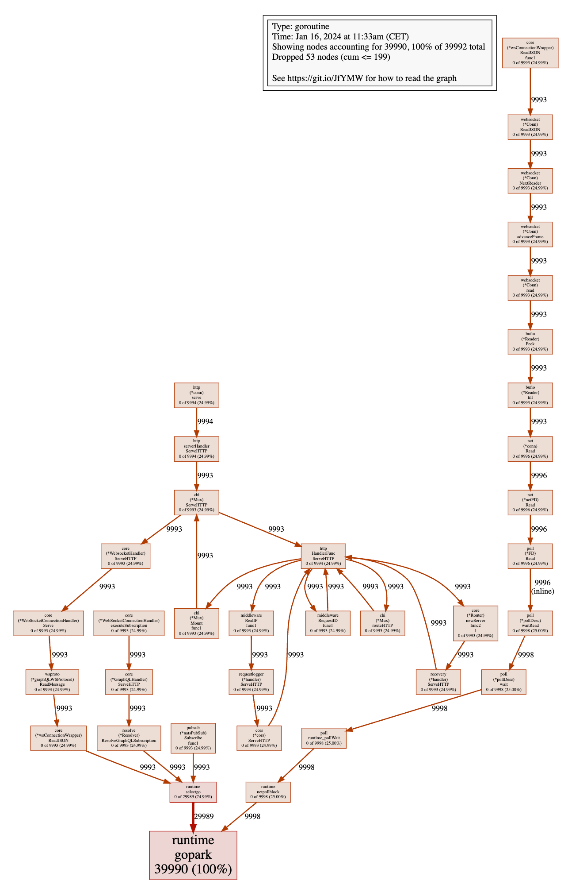
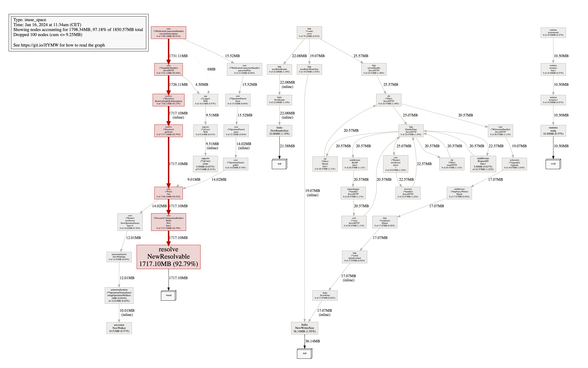
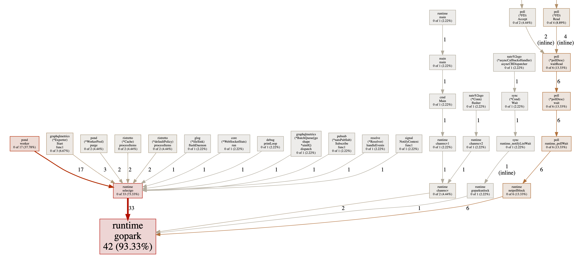
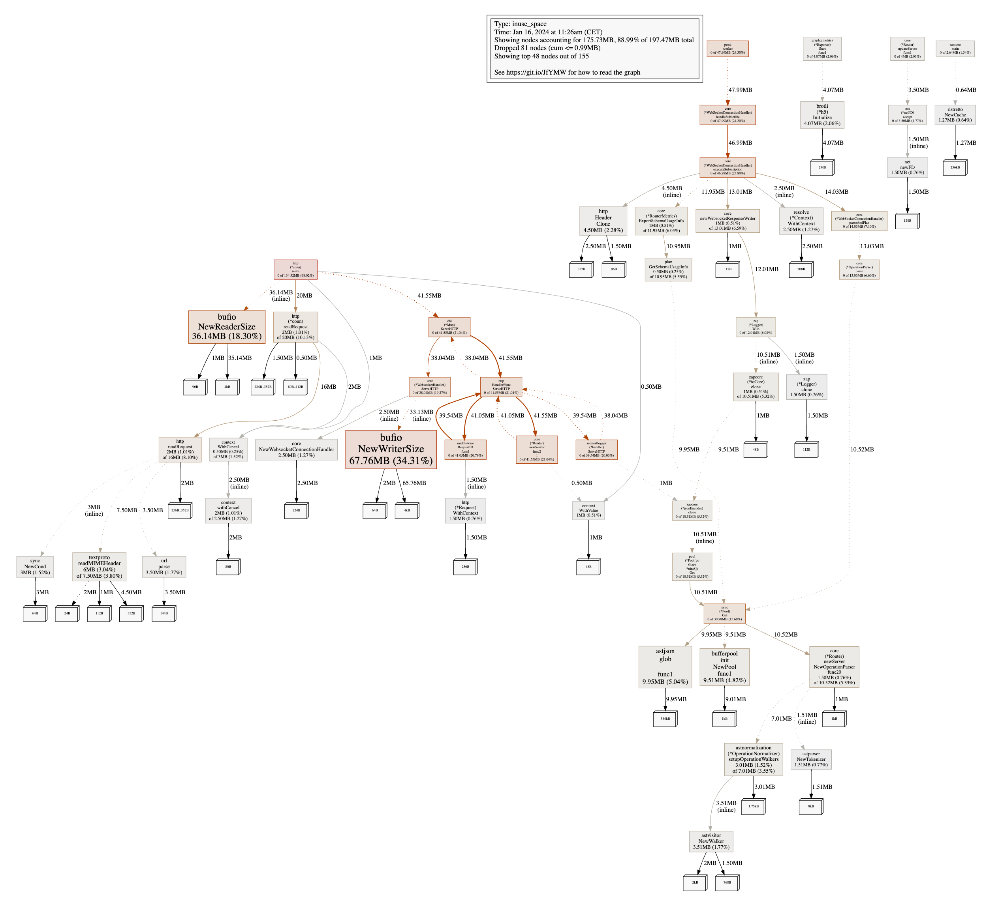

# Масштабирование подписок GraphQL в Go с использованием Epoll и архитектуры, основанной на событиях

> Похоже, я влюбился в cosmo. Последний день марта.

"Сделай работающим, сделай правильным, сделай быстрым". Это мантра, которую вы, вероятно, слышали раньше. Это хорошая мантра, которая помогает вам сосредоточиться на том, чтобы не переусложнять решение. Я пришел к выводу, что обычно достаточно сделать это правильно, обычно это достаточно быстро, если сделать это правильно.

Когда мы начали реализацию подписок GraphQL в Cosmo Router, мы сосредоточились на том, чтобы сделать это работающим. Это было несколько месяцев назад. Это было достаточно хорошо для первой итерации и позволило нам получить отзывы от наших пользователей и лучше понять проблемное пространство.

В процессе того, как мы делали это правильно, мы сократили количество горутин на 99% и потребление памяти на 90% без жертвования производительностью. В этой статье я объясню, как мы достигли этого. Использование Epoll/Kqueue сыграло большую роль в этом, но также переосмысление архитектуры, чтобы она была более событийно-ориентированной.

Давайте отступим на шаг назад, чтобы мы все были на одной волне.

## Что такое подписки GraphQL?
Подписки GraphQL - это способ подписаться на события, происходящие в вашем приложении. Например, вы можете подписаться на создание нового комментария. Когда создается новый комментарий, сервер отправляет вам уведомление. Это очень мощная функция, которая позволяет вам создавать приложения в реальном времени.

## Как работают подписки GraphQL?
Подписки GraphQL обычно реализуются с использованием WebSockets, но они также могут работать через HTTP/2 с использованием Server-Sent Events (SSE).

Клиент открывает соединение WebSocket с сервером, отправляя запрос на обновление HTTP. Сервер обновляет соединение и согласовывает протокол подписок GraphQL. В настоящее время используются два основных протокола: `graphql-ws` и `graphql-transport-ws`.

После того, как согласован протокол подписки GraphQL, клиент может отправить сообщение на сервер, чтобы начать подписку. Затем сервер будет отправлять сообщение клиенту, когда появляются новые данные. Чтобы завершить подписку, клиент или сервер могут отправить сообщение, чтобы остановить подписку.

## Как работают федеративные подписки GraphQL?
Федеративные подписки GraphQL немного сложнее обычных подписок GraphQL. Здесь не только клиент и сервер, но и шлюз или маршрутизатор между ними. Тем не менее, поток данных очень похож.

Клиент открывает соединение WebSocket с шлюзом. Затем шлюз открывает соединение WebSocket с исходным сервером. Шлюз затем пересылает все сообщения между клиентом и исходным сервером.

Вместо настройки и согласования одного протокола подписки GraphQL, шлюз настраивает и согласовывает два протокола подписки GraphQL.

## Каковы ограничения использования классических подписок GraphQL с федерацией?
Идея федерации GraphQL заключается в том, что разрешение полей сущности может быть разделено на несколько сервисов. Сущность - это тип, определенный в схеме GraphQL. У сущностей есть директива `@key`, которая определяет поля, используемые для идентификации сущности. Например, у сущности `User` может быть директива `@key(fields: "id")`. Ключи используются для разрешения (объединения) полей сущности через сервисы.

Проблема с сущностями и подписками заключается в том, что подписки должны иметь одно корневое поле, которое связывает "аннулирование" подписки с одним сервисом. Таким образом, если несколько сервисов вносят поля в нашу сущность `User`, они должны координировать друг с другом для аннулирования подписки.

Это создает зависимости между подграфами, чего мы хотим избегать по двум причинам. Во-первых, это означает, что мы должны реализовать некоторый механизм координации между подграфами. Во-вторых, это означает, что разные команды, владеющие подграфами, больше не могут двигаться независимо, но должны координировать развертывания и т.д... Оба этих аспекта противоречат цели использования федерации GraphQL.

## Введение в Event-Driven Federated Subscriptions (EDFS)
Для решения ограничений классических подписок GraphQL с федерацией мы представили Event-Driven Federated Subscriptions (EDFS). Вкратце, EDFS позволяет управлять подписками из потока событий, такого как Kafka или NATS. Это отделяет корневое поле подписки от подграфов, решая вышеупомянутые ограничения. Вы можете прочитать полное объявление о EDFS [здесь](https://wundergraph.com/blog/announcing_edfs_event_driven_federated_subscriptions).

## Правильная настройка EDFS
Когда мы начали реализацию EDFS в Cosmo Router, мы сосредоточились на том, чтобы сделать это работающим. Наша "наивная" реализация была очень простой:
1. Клиент открывает соединение WebSocket с маршрутизатором
2. Клиент и маршрутизатор согласовывают протокол подписок GraphQL
3. Клиент отправляет сообщение, чтобы начать подписку
4. Маршрутизатор подписывается на поток событий
5. Маршрутизатор отправляет сообщение клиенту, когда получает новое событие

Мы сделали это работающим, но было несколько проблем с этим подходом. Мы установили бенчмарк для измерения некоторых статистик с `pprof` при подключении 10 000 клиентов. Мы настроили наш маршрутизатор для включения HTTP-сервера `pprof` и начали бенчмарк.

## Использование pprof для измерения работающей программы Go 

Для измерения работающей программы на Go мы можем использовать HTTP-сервер `pprof`. Вы можете включить его так:

```go
//go:build pprof

package profile

import (
	"flag"
	"log"
	"net/http"
	"net/http/pprof"
	"strconv"
)

var (
	pprofPort = flag.Int("pprof-port", 6060, "Port for pprof server, set to zero to disable")
)

func initPprofHandlers() {
	// Allow compiling in pprof but still disabling it at runtime
	if *pprofPort == 0 {
		return
	}
	mux := http.NewServeMux()
	mux.HandleFunc("/debug/pprof/", pprof.Index)
	mux.HandleFunc("/debug/pprof/cmdline", pprof.Cmdline)
	mux.HandleFunc("/debug/pprof/profile", pprof.Profile)
	mux.HandleFunc("/debug/pprof/symbol", pprof.Symbol)
	mux.HandleFunc("/debug/pprof/trace", pprof.Trace)

	server := &http.Server{
		Addr: ":" + strconv.Itoa(*pprofPort),
	}
	log.Printf("starting pprof server on port %d - do not use this in production, it is a security risk", *pprofPort)
	go func() {
		if err := server.ListenAndServe(); err != nil {
			log.Fatal("error starting pprof server", err)
		}
	}()
}
```

Теперь мы можем запустить нашу программу, подключить 10 000 клиентов и выполнить следующую команду для измерения количества горутин:

```bash
$ go tool pprof http://localhost:6060/debug/pprof/goroutine
```

Кроме того, мы можем измерить выделение кучи / потребление памяти:

```bash
$ go tool pprof http://localhost:6060/debug/pprof/heap
```

Давайте посмотрим на результаты!

### Гороутины (наивная реализация EDFS)
Сначала посмотрим на количество создаваемых горутин.



Это действительно много горутин! Похоже, что мы создаем 4 горутины на клиента и подписку. Давайте ближе посмотрим, что происходит.

Все 4 горутины вызывают `runtime.gopark`, что означает, что они ждут чего-то. 3 из них вызывают `runtime.selectgo`, что означает, что они ждут, когда канал получит сообщение. Другая вызывает `runtime.netpollblock`, что означает, что она ждет сетевого события.

Из 3 других горутин одна вызывает `core.(*wsConnectionWrapper).ReadJSON`, поэтому она ждет, когда клиент отправит сообщение. Вторая вызывает `resolve.(*Resolver).ResolveGraphQLSubscription`, поэтому она ждет на канале следующего события, которое нужно разрешить. Третья вызывает `pubsub.(*natsPubSub).Subscribe`, что означает, что она ждет сообщение от потока событий.

Здесь происходит много ожидания, если вы спросите меня. Вы, возможно, слышали, что горутины дешевы и что вы можете создать миллионы из них. Вы действительно можете создать много горутин, но они не бесплатны. Давайте посмотрим на потребление памяти, чтобы увидеть, влияет ли количество горутин на потребление памяти.

### Выделение кучи / потребление памяти (наивная реализация EDFS)



Куча почти 2 ГБ, что означает, что мы запрашиваем около 3,5 ГБ памяти у ОС (это можно проверить с помощью `top`). Давайте посмотрим на аллокации, чтобы увидеть, куда уходит вся эта память. 92% памяти выделяется функцией `resolve.NewResolvable`, которая вызывается `resolve.(*Resolver).ResolveGraphQLSubscription`, которая вызывается `core.(*GraphQLHandler).ServeHTTP`. Остальное - незначительно.

Далее давайте сравним это с оптимизированной реализацией EDFS.

### Горутины (оптимизированная реализация EDFS)



Теперь у нас осталось всего 42 горутины, что является снижением на 99%! Как возможно, что мы делаем то же самое с 99% меньшим количеством горутин? Мы вернемся к этому немного позже. Давайте сначала посмотрим на потребление памяти.

### Аллокация кучи / Потребление памяти (оптимизированная реализация EDFS)



Куча снизилась до 200 МБ, что является снижением на 90%! Теперь основными участниками являются `bufio.NewReaderSize` и `bufio.NewWriterSize`, которые связаны с `http.(*conn).serve`. Отдельно стоит отметить, что эти аллокации ранее были не очень заметны, потому что они были скрыты другими аллокациями.

## Анализ причин: Как уменьшить количество горутин и потребление памяти для подписок GraphQL?
Нам нужно ответить на два основных вопроса:

1. Почему мы создаем 4 горутины на клиента и подписку?
2. Почему `resolve.NewResolvable` выделяет столько памяти?

Давайте устраним их по одному, начиная с самого простого.

## Не блокируйте в методе ServeHTTP
Вот код функции WebsocketHandler ServeHTTP:

```go
func (h *WebsocketHandler) ServeHTTP(w http.ResponseWriter, r *http.Request) {
	if isWsUpgradeRequest(r) {
		upgrader := websocket.Upgrader{
			HandshakeTimeout: 5 * time.Second,
			// TODO: WriteBufferPool,
			EnableCompression: true,
			Subprotocols:      wsproto.Subprotocols(),
			CheckOrigin: func(_ *http.Request) bool {
				// Allow any origin to subscribe via WS
				return true
			},
		}
		c, err := upgrader.Upgrade(w, r, nil)
		if err != nil {
			// Upgrade() sends an error response already, just log the error
			h.logger.Warn("upgrading websocket", zap.Error(err))
			return
		}
		connectionHandler := NewWebsocketConnectionHandler(h.ctx, WebSocketConnectionHandlerOptions{
			IDs:            h.ids,
			Parser:         h.parser,
			Planner:        h.planner,
			GraphQLHandler: h.graphqlHandler,
			Metrics:        h.metrics,
			ResponseWriter: w,
			Request:        r,
			Connection:     conn,
			Protocol:       protocol,
			Logger:         h.logger,
		})
		defer connectionHandler.Close()
		connectionHandler.Serve()
		return
	}
	h.next.ServeHTTP(w, r)
}
```

Метод `ServeHTTP` блокируется до тех пор, пока не вернется метод `connectionHandler.Serve()`. Это было удобно, потому что это позволяло нам использовать оператор `defer` для закрытия соединения, и мы могли использовать `r.Context()` для распространения контекста, так как он не был отменен до возврата метода `ServeHTTP`.

Проблема этого подхода в том, что это сохраняет горутину в течение всего времени подписки. Поскольку пакет go `net/http` создает новую горутину для каждого запроса, это означает, что мы сохраняем одну горутину для каждого клиента, хотя мы уже захватили (обновили) соединение, поэтому это совершенно не нужно.

Но вместо того, чтобы просто не блокировать, мы можем сделать еще лучше и устранить еще одну горутину.

## Не читайте из соединения, когда это не нужно
Действительно ли нам нужно блокировать чтение с одной горутиной на подключенного клиента? И как возможно, что однопоточные серверы, такие как nginx или Node.js, могут обрабатывать тысячи одновременных соединений?

Ответ в том, что эти серверы управляются событиями. Они не блокируют соединение, а вместо этого ждут, когда произойдет событие. Обычно это делается с использованием Epoll/Kqueue на Linux/BSD и IOCP на Windows.

С помощью Epoll/Kqueue мы можем делегировать ожидание события операционной системе (ОС). Мы можем сказать ОС, чтобы она уведомляла нас, когда есть данные для чтения из соединения.

Типичный шаблон использования соединений WebSocket с подписками GraphQL заключается в том, что клиент инициирует соединение, отправляет сообщение, чтобы начать подписку, а затем ждет, когда сервер отправит сообщение. Так что здесь не происходит много обмена данными. Это идеально подходит для Epoll/Kqueue.

Давайте посмотрим, как мы можем использовать Epoll/Kqueue для управления нашими соединениями WebSocket:

```go
func (h *WebsocketHandler) ServeHTTP(w http.ResponseWriter, r *http.Request) {
	upgrader := ws.HTTPUpgrader{
		Timeout: time.Second * 5,
		Protocol: func(s string) bool {
			if wsproto.IsSupportedSubprotocol(s) {
				subProtocol = s
				return true
			}
			return false
		},
	}
	c, rw, _, err := upgrader.Upgrade(r, w)
	if err != nil {
		requestLogger.Warn("Websocket upgrade", zap.Error(err))
		_ = c.Close()
		return
	}

	// After successful upgrade, we can't write to the response writer anymore
	// because it's hijacked by the websocket connection

	conn := newWSConnectionWrapper(c, rw)
	protocol, err := wsproto.NewProtocol(subProtocol, conn)
	if err != nil {
		requestLogger.Error("Create websocket protocol", zap.Error(err))
		_ = c.Close()
		return
	}

	handler := NewWebsocketConnectionHandler(h.ctx, WebSocketConnectionHandlerOptions{
		Parser:         h.parser,
		Planner:        h.planner,
		GraphQLHandler: h.graphqlHandler,
		Metrics:        h.metrics,
		ResponseWriter: w,
		Request:        r,
		Connection:     conn,
		Protocol:       protocol,
		Logger:         h.logger,
		Stats:          h.stats,
		ConnectionID:   h.connectionIDs.Inc(),
		ClientInfo:     clientInfo,
		InitRequestID:  requestID,
	})
	err = handler.Initialize()
	if err != nil {
		requestLogger.Error("Initializing websocket connection", zap.Error(err))
		handler.Close()
		return
	}

	// Only when epoll is available. On Windows, epoll is not available
	if h.epoll != nil {
		err = h.addConnection(c, handler)
		if err != nil {
			requestLogger.Error("Adding connection to epoll", zap.Error(err))
			handler.Close()
		}
		return
	}

	// Handle messages sync when epoll is not available

	go h.handleConnectionSync(handler)
}
```

Если доступен epoll, мы добавляем соединение в экземпляр epoll и возвращаемся. В противном случае мы обрабатываем соединение синхронно в новой горутине как запасной вариант, но по крайней мере мы больше не блокируем метод `ServeHTTP`.

Вот код для использования экземпляра epoll:

```go
func (h *WebsocketHandler) runPoller() {
	done := h.ctx.Done()
	defer func() {
		h.connectionsMu.Lock()
		_ = h.epoll.Close(true)
		h.connectionsMu.Unlock()
	}()
	for {
		select {
		case <-done:
			return
		default:
			connections, err := h.epoll.Wait(128)
			if err != nil {
				h.logger.Warn("Epoll wait", zap.Error(err))
				continue
			}
			for i := 0; i < len(connections); i++ {
				if connections[i] == nil {
					continue
				}
				conn := connections[i].(epoller.ConnImpl)
				// check if the connection is still valid
				fd := socketFd(conn)
				h.connectionsMu.RLock()
				handler, exists := h.connections[fd]
				h.connectionsMu.RUnlock()
				if !exists {
					continue
				}

				err = handler.conn.conn.SetReadDeadline(time.Now().Add(h.readTimeout))
				if err != nil {
					h.logger.Debug("Setting read deadline", zap.Error(err))
					h.removeConnection(conn, handler, fd)
					continue
				}

				msg, err := handler.protocol.ReadMessage()
				if err != nil {
					if isReadTimeout(err) {
						continue
					}
					h.logger.Debug("Client closed connection")
					h.removeConnection(conn, handler, fd)
					continue
				}

				err = h.HandleMessage(handler, msg)
				if err != nil {
					h.logger.Debug("Handling websocket message", zap.Error(err))
					if errors.Is(err, errClientTerminatedConnection) {
						h.removeConnection(conn, handler, fd)
						return
					}
				}
			}
		}
	}
}
```

Мы используем одну единственную горутину для ожидания событий от экземпляра epoll. Если у соединения есть событие, мы проверяем, действительно ли соединение еще валидно. Если это так, мы читаем сообщение и обрабатываем его. Для обработки сообщения мы используем пул потоков за кулисами, чтобы не блокировать горутину epoll слишком долго. Полную реализацию можно найти на [GitHub](https://github.com/wundergraph/cosmo/blob/main/router/core/websocket.go).

С этим подходом мы уже сократили количество горутин на 50%. Теперь у нас осталось 2 горутины на клиента и подписку. Мы больше не блокируемся в функции `ServeHTTP` и больше не блокируем чтение из соединения.

Это оставляет 3 проблемы. Нам нужно устранить еще 2 горутины для подписки и уменьшить потребление памяти `resolve.NewResolvable`. Как оказалось, все эти проблемы связаны.

## Блокирующие чтения против архитектуры, основанной на событиях

Давайте посмотрим на наивную реализацию `ResolveGraphQLSubscription`:

```go
func (r *Resolver) ResolveGraphQLSubscription(ctx *Context, subscription *GraphQLSubscription, writer FlushWriter) (err error) {

	buf := pool.BytesBuffer.Get()
	defer pool.BytesBuffer.Put(buf)
	if err := subscription.Trigger.InputTemplate.Render(ctx, nil, buf); err != nil {
		return err
	}
	rendered := buf.Bytes()
	subscriptionInput := make([]byte, len(rendered))
	copy(subscriptionInput, rendered)

	if len(ctx.InitialPayload) > 0 {
		subscriptionInput, err = jsonparser.Set(subscriptionInput, ctx.InitialPayload, "initial_payload")
		if err != nil {
			return err
		}
	}

	if ctx.Extensions != nil {
		subscriptionInput, err = jsonparser.Set(subscriptionInput, ctx.Extensions, "body", "extensions")
	}

	c, cancel := context.WithCancel(ctx.Context())
	defer cancel()
	resolverDone := r.ctx.Done()

	next := make(chan []byte)

	cancellableContext := ctx.WithContext(c)

	if err := subscription.Trigger.Source.Start(cancellableContext, subscriptionInput, next); err != nil {
		if errors.Is(err, ErrUnableToResolve) {
			msg := []byte(`{"errors":[{"message":"unable to resolve"}]}`)
			return writeAndFlush(writer, msg)
		}
		return err
	}

	t := r.getTools()
	defer r.putTools(t)

	for {
		select {
		case <-resolverDone:
			return nil
		case data, ok := <-next:
			if !ok {
				return nil
			}
			t.resolvable.Reset()
			if err := t.resolvable.InitSubscription(ctx, data, subscription.Trigger.PostProcessing); err != nil {
				return err
			}
			if err := t.loader.LoadGraphQLResponseData(ctx, subscription.Response, t.resolvable); err != nil {
				return err
			}
			if err := t.resolvable.Resolve(ctx.ctx, subscription.Response.Data, writer); err != nil {
				return err
			}
			writer.Flush()
		}
	}
}
```

В этой реализации есть много проблем:

1. Она блокируется
2. Она держит буфер на всё время подписки, даже если нет данных для отправки
3. Мы создаём триггер для каждой подписки, хотя триггер может быть одинаковым для нескольких подписок
4. Мы блокируем чтение из триггера
5. Функция `getTools` выделяет много памяти. Поскольку мы блокируем родительскую функцию на всё время подписки, эта память не освобождается до окончания подписки. Это строка кода, которая выделяет большую часть памяти.

Чтобы решить эти проблемы, нужно вспомнить знаменитые слова Роба Пайка о Go:

> Don't communicate by sharing memory, share memory by communicating. (Не общайтесь, разделяя память, разделяйте память, общаясь.)

Вместо того, чтобы иметь горутину, которая блокируется на канале, и другую, которая блокируется на триггере, и всю эту память, которая выделяется, пока мы блокируемся, мы могли бы вместо этого иметь одну горутину, которая ждёт событий, таких как: `client subscribes`, `client unsubscribes`, `trigger has data`, `trigger is done` etc...

Эта одна горутина будет управлять всеми событиями в одном цикле, что на самом деле довольно просто реализовать и поддерживать. Кроме того, мы можем использовать пул потоков для обработки событий, чтобы не блокировать основной цикл слишком долго. Это очень похоже на подход epoll, который мы использовали для соединений WebSocket, не так ли?

Давайте посмотрим на оптимизированную реализацию `ResolveGraphQLSubscription`:

```go
func (r *Resolver) AsyncResolveGraphQLSubscription(ctx *Context, subscription *GraphQLSubscription, writer SubscriptionResponseWriter, id SubscriptionIdentifier) (err error) {
	if subscription.Trigger.Source == nil {
		return errors.New("no data source found")
	}
	input, err := r.subscriptionInput(ctx, subscription)
	if err != nil {
		msg := []byte(`{"errors":[{"message":"invalid input"}]}`)
		return writeFlushComplete(writer, msg)
	}
	xxh := pool.Hash64.Get()
	defer pool.Hash64.Put(xxh)
	err = subscription.Trigger.Source.UniqueRequestID(ctx, input, xxh)
	if err != nil {
		msg := []byte(`{"errors":[{"message":"unable to resolve"}]}`)
		return writeFlushComplete(writer, msg)
	}
	uniqueID := xxh.Sum64()
	select {
	case <-r.ctx.Done():
		return ErrResolverClosed
	case r.events <- subscriptionEvent{
		triggerID: uniqueID,
		kind:      subscriptionEventKindAddSubscription,
		addSubscription: &addSubscription{
			ctx:     ctx,
			input:   input,
			resolve: subscription,
			writer:  writer,
			id:      id,
		},
	}:
	}
	return nil
}
```

Мы добавили функцию к интерфейсу `Trigger` для генерации уникального `ID`. Это используется для уникальной идентификации `Trigger`. Внутри эта функция учитывает входные данные, контекст запроса, заголовки, дополнительные поля и т.д., чтобы гарантировать, что мы случайно не используем один и тот же `Trigger` для разных подписок.

Как только у нас есть уникальный `ID` для `Trigger`, мы отправляем событие в основной цикл, чтобы "подписаться" на `Trigger`. Это все, что мы делаем в этой функции. Мы больше не блокируемся, нет тяжелых аллокаций.

Далее давайте посмотрим на основной цикл:

```go
func (r *Resolver) handleEvents() {
	done := r.ctx.Done()
	for {
		select {
		case <-done:
			r.handleShutdown()
			return
		case event := <-r.events:
			r.handleEvent(event)
		}
	}
}

func (r *Resolver) handleEvent(event subscriptionEvent) {
	switch event.kind {
	case subscriptionEventKindAddSubscription:
		r.handleAddSubscription(event.triggerID, event.addSubscription)
	case subscriptionEventKindRemoveSubscription:
		r.handleRemoveSubscription(event.id)
	case subscriptionEventKindRemoveClient:
		r.handleRemoveClient(event.id.ConnectionID)
	case subscriptionEventKindTriggerUpdate:
		r.handleTriggerUpdate(event.triggerID, event.data)
	case subscriptionEventKindTriggerDone:
		r.handleTriggerDone(event.triggerID)
	case subscriptionEventKindUnknown:
		panic("unknown event")
	}
}
```

Это простой цикл, который работает в одной горутине, ожидая событий до отмены контекста. Когда событие получено, оно обрабатывается вызовом соответствующей функции обработчика.

В этом шаблоне есть что-то мощное, что может быть не очевидно на первый взгляд. Если мы запускаем этот цикл в одной горутине, нам не нужно использовать никакие блокировки для синхронизации доступа к триггерам. Например, когда мы добавляем подписчика к триггеру или удаляем его, нам не нужно использовать блокировку, потому что мы всегда делаем это в той же горутине.

Давайте посмотрим, как мы обрабатываем обновление триггера:

```go
func (r *Resolver) handleTriggerUpdate(id uint64, data []byte) {
	trig, ok := r.triggers[id]
	if !ok {
		return
	}
	if r.options.Debug {
		fmt.Printf("resolver:trigger:update:%d\n", id)
	}
	wg := &sync.WaitGroup{}
	wg.Add(len(trig.subscriptions))
	trig.inFlight = wg
	for c, s := range trig.subscriptions {
		c, s := c, s
		r.triggerUpdatePool.Submit(func() {
			r.executeSubscriptionUpdate(c, s, data)
			wg.Done()
		})
	}
}

func (r *Resolver) executeSubscriptionUpdate(ctx *Context, sub *sub, sharedInput []byte) {
	sub.mux.Lock()
	sub.pendingUpdates++
	sub.mux.Unlock()
	if r.options.Debug {
		fmt.Printf("resolver:trigger:subscription:update:%d\n", sub.id.SubscriptionID)
		defer fmt.Printf("resolver:trigger:subscription:update:done:%d\n", sub.id.SubscriptionID)
	}
	t := r.getTools()
	defer r.putTools(t)
	input := make([]byte, len(sharedInput))
	copy(input, sharedInput)
	if err := t.resolvable.InitSubscription(ctx, input, sub.resolve.Trigger.PostProcessing); err != nil {
		return
	}
	if err := t.loader.LoadGraphQLResponseData(ctx, sub.resolve.Response, t.resolvable); err != nil {
		return
	}
	sub.mux.Lock()
	sub.pendingUpdates--
	defer sub.mux.Unlock()
	if sub.writer == nil {
		return // subscription was already closed by the client
	}
	if err := t.resolvable.Resolve(ctx.ctx, sub.resolve.Response.Data, sub.writer); err != nil {
		return
	}
	sub.writer.Flush()
	if r.reporter != nil {
		r.reporter.SubscriptionUpdateSent()
	}
}
```

В первой функции вы можете видеть, как мы изменяем структуры триггера и подписки. Помните, что всё это всё еще происходит в основном цикле, поэтому это безопасно делать без блокировок.

Мы создаем группу ожидания, чтобы предотвратить закрытие триггера до того, как все подписчики будут уведомлены об обновлении. Она используется в другой функции в случае, если мы закрываем триггер.

Далее вы можете видеть, что мы отправляем фактический процесс разрешения обновления для каждого подписчика в пул потоков. Это единственное место, где мы используем параллелизм при обработке событий. Использование пула потоков здесь имеет два преимущества. Во-первых, очевидное, мы не блокируем основной цикл во время разрешения обновления. Во-вторых, но не менее важно, мы можем ограничить количество одновременно разрешаемых обновлений. Это очень важно, потому что, как вы знаете, в предыдущей реализации мы выделяли много памяти в функции `getTools`, потому что мы не ограничивали это.

Вы можете видеть, что мы вызываем `getTools` только в функции `executeSubscriptionUpdate`, когда мы фактически разрешаем обновление. Эта функция очень короткоживущая, и поскольку мы используем пул потоков для выполнения и `sync.Pool` для инструментов, мы можем эффективно повторно использовать инструменты и, следовательно, уменьшить общее потребление памяти.

Если вас интересует полная реализация резолвера, вы можете найти её на [GitHub](https://github.com/wundergraph/graphql-go-tools/blob/master/v2/pkg/engine/resolve/resolve.go).

## Резюме
Мы начали с наивной реализации EDFS, которая работала нормально, но мы поняли, что у нее есть некоторые ограничения. Благодаря наличию первоначальной реализации, мы смогли определить набор тестов, чтобы "закрепить" ожидаемое поведение системы.

Затем мы определили ключевые проблемы нашей первоначальной реализации:

1. Мы создавали 4 горутины на клиента и подписку
2. Мы выделяли много памяти в функции `resolve.NewResolvable`
3. Мы блокировались в функции `ServeHTTP`
4. Мы блокировали чтение из соединения

Мы решили эти проблемы следующим образом:

1. Использование Epoll/Kqueue, чтобы не блокировать соединение
2. Использование архитектуры, основанной на событиях, чтобы не блокировать подписку
3. Использование пула потоков, чтобы не блокировать основной цикл при разрешении обновления подписки (и ограничить количество одновременных обновлений)
4. Использование `sync.Pool` для повторного использования инструментов при разрешении обновления подписки

С помощью этих изменений мы сократили количество горутин на 99% и потребление памяти на 90% без жертвования производительностью.

Мы не "рыбачили в темноте", мы использовали `pprof` для точного анализа того, что происходило и где были узкие места. Кроме того, мы использовали `pprof` для измерения влияния наших изменений.

Благодаря нашему набору тестов, мы смогли внести эти изменения, не нарушив ничего.

## Заключительные мысли
Возможно, мы могли бы еще больше сократить потребление памяти, поскольку аллокации пакета `bufio` все еще довольно заметны в профиле кучи. Тем не менее, мы осознаем, что преждевременная оптимизация - это корень всех бед, поэтому мы откладываем дальнейшие оптимизации до тех пор, пока они действительно нам не понадобятся.

Существует спектр между "быстрым кодом" и "кодом, который быстро понять". Чем больше вы оптимизируете, тем сложнее становится код. На данный момент мы довольны результатами и уверены, что можем эффективно поддерживать код.

Если вас интересует изучение EDFS, вы можете прочитать полное объявление [здесь](https://wundergraph.com/blog/announcing_edfs_event_driven_federated_subscriptions). Также доступна некоторая документация на [Cosmo Docs](https://cosmo-docs.wundergraph.com/router/event-driven-federated-subscriptions-edfs). Если вам больше нравится смотреть видео, чем читать, вы также можете посмотреть [демо EDFS на YouTube](https://www.youtube.com/watch?v=t0U_PJF2JCw).

Я надеюсь, вам понравился этот блог и вы узнали что-то новое. Если у вас есть какие-либо вопросы или отзывы, не стесняйтесь комментировать или связаться со мной в [Twitter](https://twitter.com/TheWorstFounder).

## Благодарности
Я черпал вдохновение из проекта [1M-go-websockets](https://github.com/eranyanay/1m-go-websockets). Благодарю Эрана Янай за создание этого проекта и за то, что он делится своими знаниями с сообществом.
